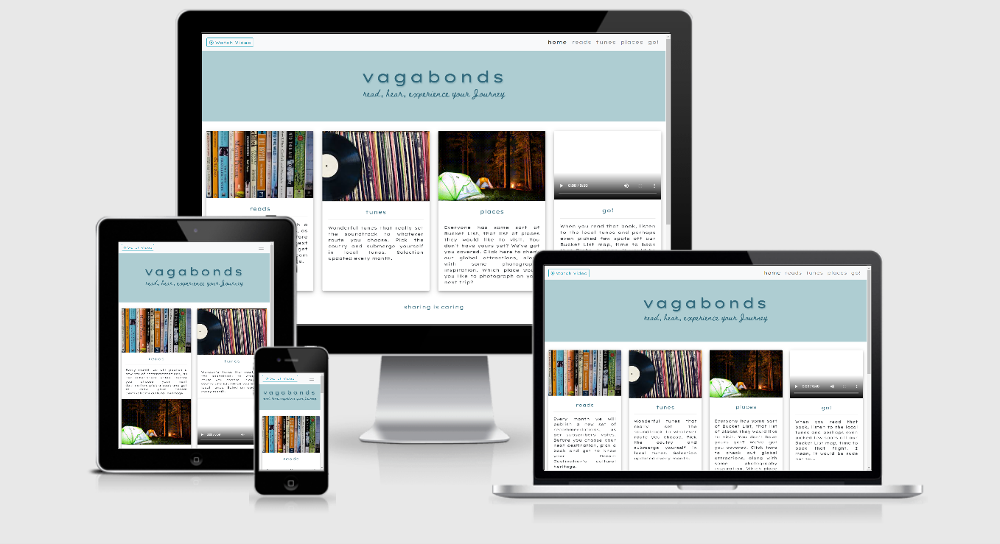
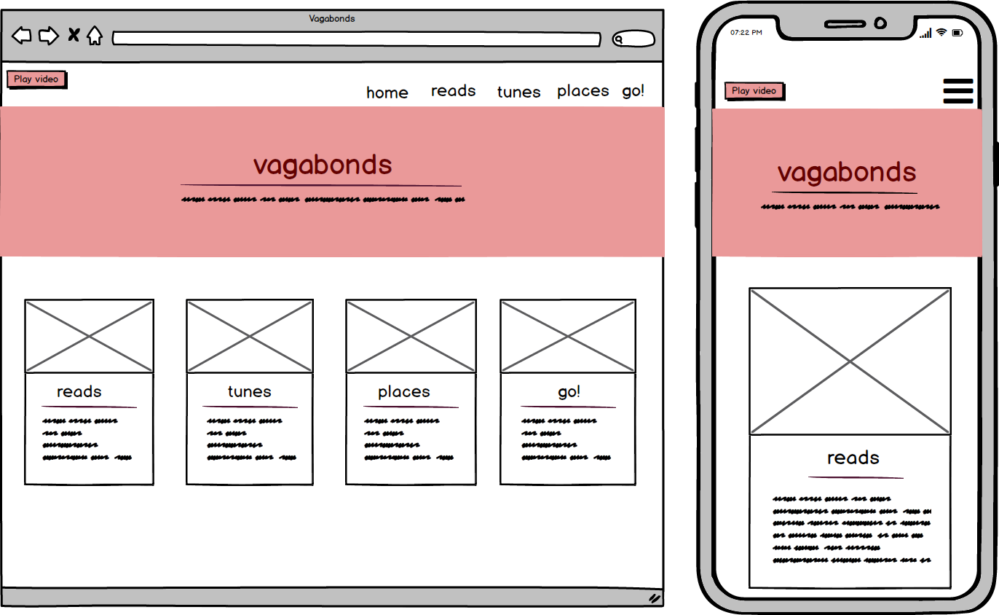
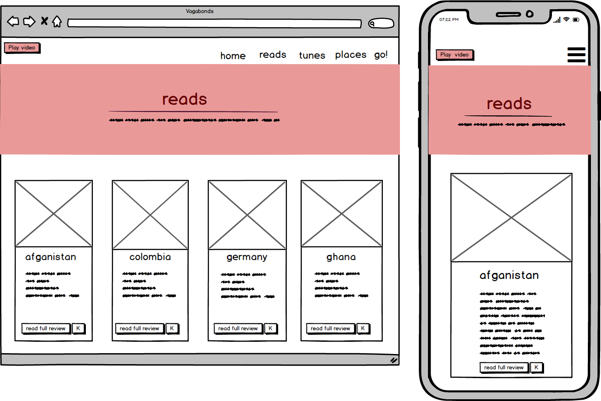
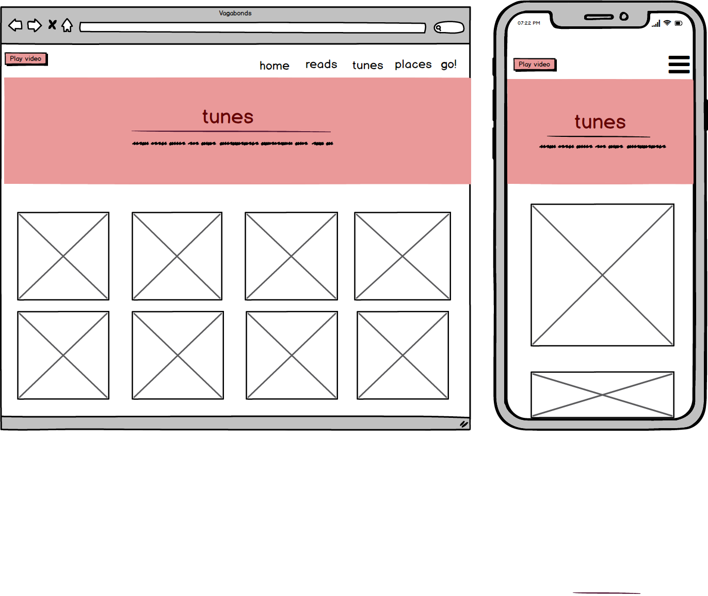
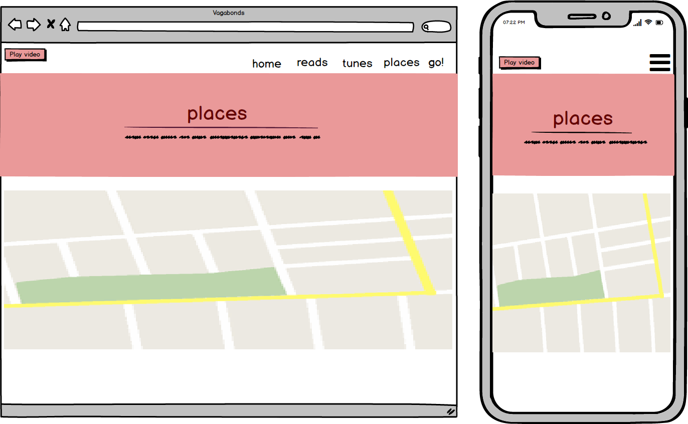
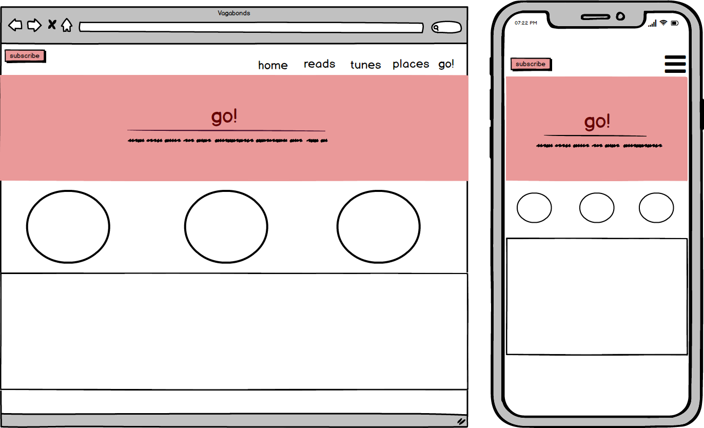

# Vagabonds
A wanderers' website 
#### Live website <i>https://bezebee.github.io/Vagabond/</i>

# ABOUT
Vagabonds process of creation was always about one thing, love of art and travelling and how both can be source of inspiration. This website will appeal to users who often choose a book before they plan their holidays. They will then bring this book with them and continue onto getting to know the country they are reading about. It is inspired by a friend of mine whom I travelled Iceland with. She brought a book with her and told me stories about places we were just visiting. I thought it was such an amazing way of experiencing the book.
 
# UI/UX

The theme of the page is travel, ideally user should be looking at it as a shelf full of inspiration. The color scheme and typography was selected to be fun, friendly and inviting. Ideally this page is addressed at a wide demographic of age, assuming users are also travel lovers.

### Typography

The main font is Lexend Peta with some decorative parts being styled in Beth Ellen.

### Colors

Initially I was going to go with two shades of pink for this project, you will notice on my wireframes that the pink design appeared light and happy. And this would be the reason for the initial color choice. When the project was almost completed, I asked for few opinions from potential users and after some deliberation I decided that the color choice may narrow the user demographic a bit. I decided to go for a teal blue instead, as it appears more gender universal.
Dark Teal : rgb (49, 105, 124)
Light Teal : rgb (174, 205, 210)

### User Stories

- As a user I want to know if this site is for me and what does it have to offer
- As a book lover and travel amateur I treat the site as a source of information
- As a user I expect the site to be intuitive, with easy access to the next stage of the page
- As a user I appreciate if every click serves a useful information
- When I click on the books, I would like to see on the map where is the action taking place
- As a music lover, once I discovered new music, I expect this site to tell me more about the band and provide samples of tunes
- Whether I am a seasoned traveller or a newbie to wandering the world, this site should suggest few places I might want to visit, even without me having to read a book or listen to the tune
- As a regular user I would like to be able to subscribe to any news this site has to offer
- Once inspired by all of the ideas, as a user, I'd like to be able to check out some flights and perhaps even book some
 
### Wireframes

# FEATURES

The motto of this website is to "Read, Hear, Experience the Journey". As the website is all about discovering the world through various sources of inspiration, there are few little surprises all over it to grab the attention of visitor and make this experience of site visit moreso fun and inviting to return again.

The main five pages the visitor can check out and make use of are Home, Reads, Tunes, Places, Go!

### Home
Welcomes the user with a big jumbotron with name of the website on it. Vagabond means a wanderer, a traveller, a nomad. Whether the user is a nomad or not, most of the time they will imagine themselves as such, thus the character of this website will attract them. There are four cards on this page, each offers a short explanation of what one should expect from visiting this site. When user hovers over the card title, it will bring them to that page. One of the cards also acts as a video inspiration and again statement of what is the page about. The same video can be viewed when one clics on the Video link in the footer.As we scroll down the page, there is an opportunity to share the page to various social media outlets, after which there is a Subscribe form. 

### Reads 
Reads is a selection of books. In the future Subscribers, called Vagabonds, will be able to submit their own favourite books. The theme of the books is not necessary about travelling, but various countries act as a backdrop, which will serve as inspiration and source of information. Each card is decorated with a book cover and visible title. Underneath it there is a country to which this book will take the reader and a globe icon next to the country, to show a marker. This lets the user visualise geographical location of this book. Within the modal there is also a button available, which brings the user to a Lonely Planet article about that country. User can also read a short extract of the book review, as well as that, there is an entire review linked under the extract. This will assist the visitor with deciding whether they want to read that book. Once they are ready to purchase it, there is an immediate option of buying it via Kindle outlet.

### Tunes
This page welcomes the user with a grid full of images, user has to hover over them to discover what countries the music comes from. On the other side of the image one reads the name of the musician and the country they are coming from. There is also an opportunity to check out a Spotify playlist, Youtube playlist, Google and some information on Wikipedia. Below these icons there is a sample video, so if the user has no time or patience for going to any external pages (which will open in a separate tab for them), they can watch a bit of YouTube video to get a feel of that musician.

### Places

Here a main section of the page is a map with over fourty markers with worldwide attractions. Each marker, when clicked on, unravels a modal with a characteristic image of that attraction. Some will seem familiar as these are famous worldwide landmarks and some the user would have never seen before. If image in the modal sparks interest and user would like to find out a bit more about the location, there are links availble in a form of a button. The left button is to give more information about the location, the right button will lead to sources of travel packages, such as Intrepid Travel or Trip Advisor. One can close the modal by clicking on the map next to it. Below the map there is a seach box. If the visitor would like to see any more images about the location, they can type into the search box and a selection will come up.

### Go!

If the website served its purpose, by now the visitor would love to check out the flights to the countries from the books or the tunes. They can do this with the help of Skyskanner widget placed on the GO! page. On top of that page there are three clocks, which are just a bit of decoration, imitating three time-zone clocks sometimes visible above the reception desk in the hotel or at the airports. It gives the page feel of travel, the ambience is that of invitation to world exploration.

### Watch Video

From every page of this website user can access a full size version of the inspo video, which should ideally explain little bit what the page is about. 

 
# TECHNOLOGIES USED
### Bootstrap
This is a responsive, mobile first design, so Bootstrap has been of most help. Bootstrap ensures responsiveness as well as simplicity.
### HTML
The basis for this project, HTML is the standard markup language for documents designed to be displayed in a web browser. 
### CSS
Cascading Style Sheets are an example of a style sheet language used for describing the presentation of a document written in a HTML.
### Javascript

### Gitpod
An Integrated Development Environment (IDE) designed to provide platform for software development and website design
### Google Fonts
Very resource rich service offered by Google
### Adobe Fonts
Resource used for the logo font
### Minify Code
http://minifycode.com/html-beautifier/
Used for beautifying HTML code
### FreeFormatter.com 
https://www.freeformatter.com/css-beautifier.html
Used for beautifying CSS code

# TESTING

##### As a user I want to know if this site is for me and what does it have to offer
The name Vagabond was chosen to immediately jump out as a website for those who love to wander. As mentioned previously, whether one is a nomad or not, thos who continue on browsing this page, would like to see themselves as such. The romantic motto to "Read, Hear, Experience your Journey" further pulls the visitor inside and invites to explore it.

##### As a book lover and travel amateur I treat the site as a source of information
This website offers multiple inspirations all in one place. Books, music and imagery, which lets the potential traveller envision which countries they would like to visit. Furthermore, various articles and sources of information let the user educate themselves as well as plan their trip.
##### As a user I expect the site to be intuitive, with easy access to the next stage of the page
User automatically knows where to go next, whether they decide to click on the card on Home page or on the Navigation Bar, they get to the next page without issues. The tabs are named so the user knows intuitively
##### As a user I appreciate if every click serves a useful information
Throughout the page there is an abundance of information offered to the visitor, to fullfil the taks of providing the inspiration. Should the user choose to click on the Reads, they are welcomed with a selection of books. They might have not heard about some of the books, the sample of review may give them a glimpse of whether the book may spark their interest or not. If it sparked their interest, users are immediately offered opportunity to purchase the book for Kindle, which means an immediate ownership of that book. Similar of the page with tunes or with places, multiple opportunities to read about the artist or access information about interesting activities in the area are offered.
##### When I click on the books, I would like to see on the map where is the action taking place
In case they might be interested in travelling to the country in which the action of the book takes place, a modal with map location also offers article about that country. User is surrounded with this information, in case it is the first time they hear about certain country. We all know what happened when Eurovision went ot Azerbaijan. 
##### Whether I am a seasoned traveller or a newbie to wandering the world, this site should suggest few places I might want to visit, even without me having to read a book or listen to the tune
When clicked on Places, the visitor has opportunity to create their own bucket list from selection of places suggested on that page. If the user is an aspiring photographer, they are offered an inspiration search, in case they would like to follow a certain image and take one of their own.
##### As a regular user I would like to be able to subscribe to any news this site has to offer
On each page there is an opportunity offered to subscribe to news.
##### Once inspired by all of the ideas, as a user, I'd like to be able to check out some flights and perhaps even book some
The last of the main tabs, Go!, is designed to give an inspired user opportunity to immediately book their flights.

### Browsers testing
Throughout the process of Vagabond design and development I have extensively utilised the Chrome Dev Tools, this allowed an instant feedback on any changes tested. Through the Dev Tools I also tested the responsiveness of the website. The feedback was good on all available screensizes

### Features testing
##### Home
- Cards links - go to Home page, click on each Card links and check if opens, does it lead to the correct page?

# DEPLOYMENT

# Deployment

## Using Github Pages

In the GitHub Repository from the project https://github.com/bezebee/Vagabond/

1. Click the 'Settings' Tab.
2. Scroll Down to the Git Hub Pages Heading.
3. Select 'Master Branch' as the source.
4. The Page will reload 'Settings' again.
5. Scroll to GitHub pages heading and there will now be a clickable link https://bezebee.github.io/Vagabond/
6. Click this link for the live deployed page

## Run Locally

In the GitHub Repository from the project https://github.com/bezebee/Vagabond/

1. Click Clone or Download
2. Copy Git URL from the dialogue box
3. Open your developement editor of choice and open a terminal window in a directory of your choice
4. Use the 'git clone' command in terminal followed by the copied git URL
5. A clone of the project will be created locally on your machine

# CREDITS
### Media

### Acknowledgements
My Mentor Precious Ijege for his timely and honest guidance, this would be entirely different project if not for his advise on tweaking the direction a little bit. 

